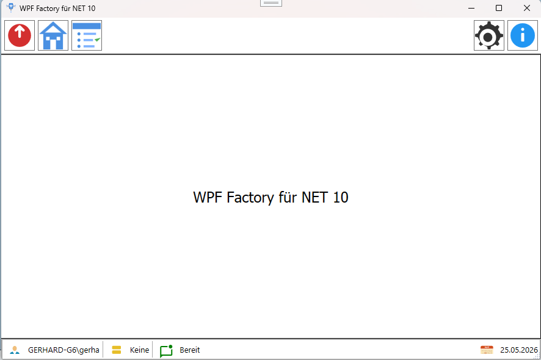

# WPF Factory

# Projekt

Das Projekt zeigt den Einsatz des Factory-Design-Patterns in einer WPF-Anwendung. Es bietet eine einfache Möglichkeit, verschiedene Komponenten zu erstellen und zu verwalten, ohne dass der Benutzer sich um die Details der Implementierung kümmern muss. Zusätzlich wird auch der EventAggregator eingesetzt um eine Anwendungsübergreifende Dialog-Navigation zu ermöglichen.

# Features

# Möglichkeiten

## Einfache Verwendung

- Migration auf NET 10
- Weiterentwicklung mit neuen Features
- Neues Design und Demoprogramm
